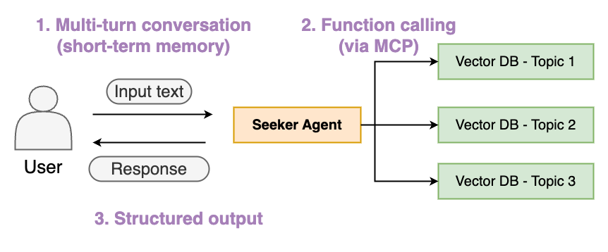

# Agent_Framework_Demo

## Environment

1. Install uv  
    - Ubuntu  
        ```bash
        curl -LsSf https://astral.sh/uv/install.sh | sh
        ```
    - MacOS  
        ```bash
        brew install uv
        ```
2. Create virtual environment   
    ```bash
    uv python install 3.12
    cd Agent_Framework_Demo
    uv venv --python 3.12
    source .venv/bin/activate
    uv sync
    ```

3. Install & build up ipykernel (used in _demo.ipynb)  
    ```bash
    uv pip install ipykernel
    python -m ipykernel install --user --name=AgentFramework --display-name "Python (AgentFramework)"
    ```

4. Add LassieRAG module to the environment  
    - Clone the project for github  
        ```bash
        git clone https://github.com/yysun0116/LassieRAG.git
        ```

    - use editable install  
        ```bash
        uv pip install -e path/to/LassieRAG
        ```

5. Initialize OpenSearch  
    ```bash
    sudo docker run -p 9200:9200 -p 9600:9600 -e "discovery.type=single-node" -e "plugins.security.disabled=true" opensearchproject/opensearch:2.11.0
    ```

## Test Agent framework
1. Preprocessing of MCP retriever construction  
    - Modified parameters in .env file  
    - Build up Index in OpenSearch vector database  
        ```bash
        uv run python3 ./demo/0_retriever_preprocess.py
        ```
2. run _demo.ipynb of different agent frameworks  

## Demo Scenario
1. Single agent
    
    - With structured output
    - Tool-use (Retrievers, via MCP)
    - Multi-turn conversation